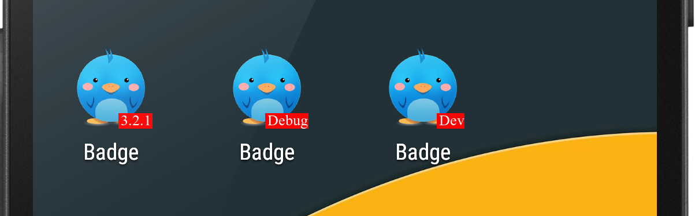

## Add badge(version code, version name, etc) for your **DEBUG APK**.



Add it to your project!

```gradle
buildscript {
  repositories {
    mavenCentral()
  }

  dependencies {
    classpath 'com.github.yuebinyun.debug-badge:debug-badge:0.1.3'
  }
}

apply plugin: 'com.android.application'
apply plugin: 'com.yuebinyun.badge'

android {
  //...
}

dependencies {
  //...
}

// if you don't set flavor
badge {
  // label = "Debug"
  // label = "Dev" // optional.  Defualt text is `Debug`
  label = "${project.android.defaultConfig.versionName}"
  labelColor = 0xFFFFFF // optional.  Default color is WHITE
  labelBgColor = 0x0099FF // optional.  Defualt color is RED
}
```

```
// if you want to add badge for flavor-debug-version app
badgeFlavor {

  demo {
    label = "demo"
    // label = "Dev" // optional.  Defualt text is `Debug`
    // label = "${project.android.defaultConfig.versionName}"
    // labelColor = 0x000000 // optional.  Default color is WHITE
    // labelBgColor = 0x0099FF // optional.  Defualt color is RED
  }

  full {
    label = "full"
    // label = "Dev" // optional.  Defualt text is `Debug`
    // label = "${project.android.defaultConfig.versionName}"
    // labelColor = 0x000000 // optional.  Default color is WHITE
    // labelBgColor = 0x0099FF // optional.  Defualt color is RED
  }

  // NOT SET
  //  flavor1 {
  //    label = "flavor1"
  //  }

  flavor2 {
    label = "flavor2"
    labelColor = 0xFF00FF // optional.  Default color is WHITE
    labelBgColor = 0x0099FF // optional.  Defualt color is RED
  }
}
```